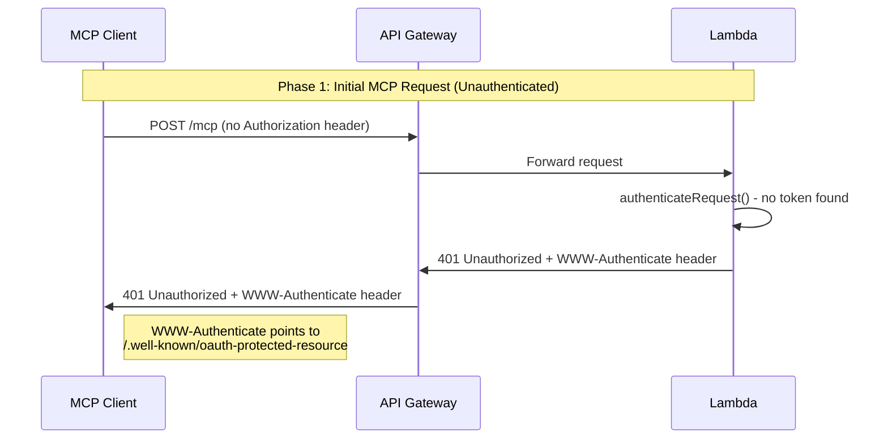
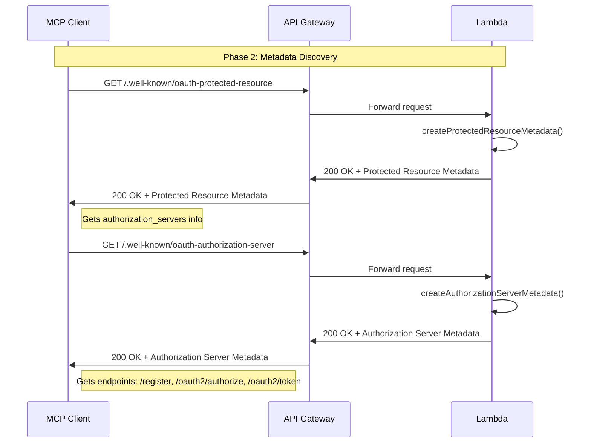
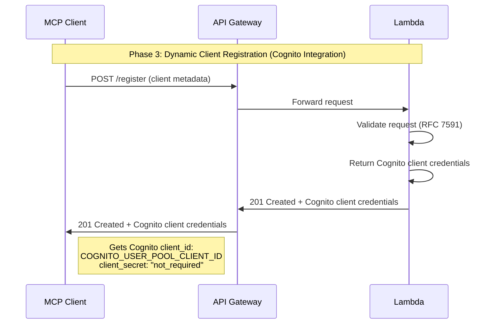
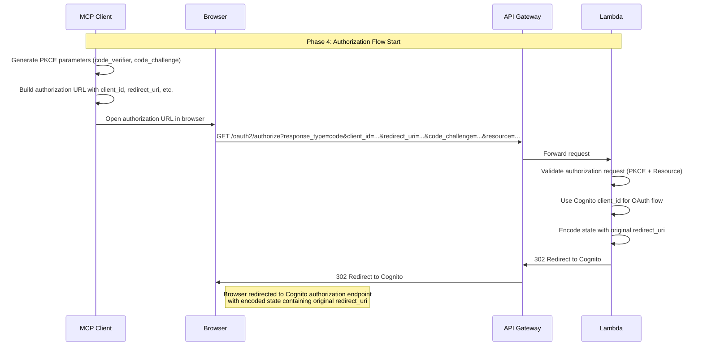
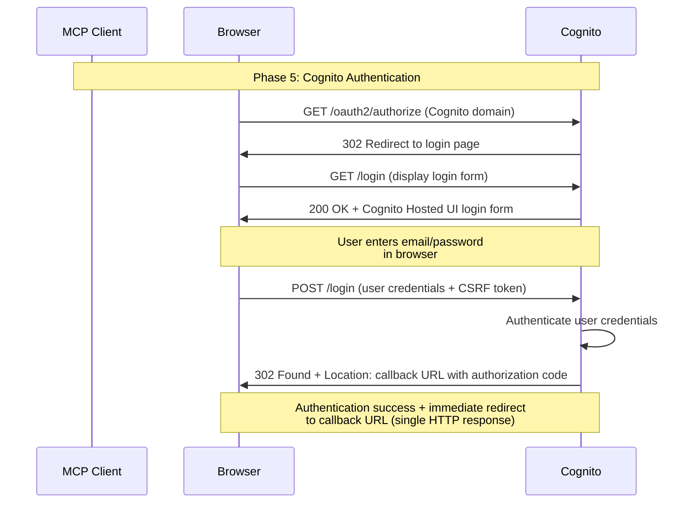
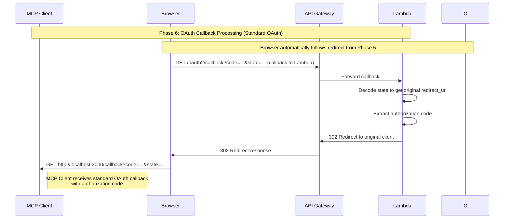
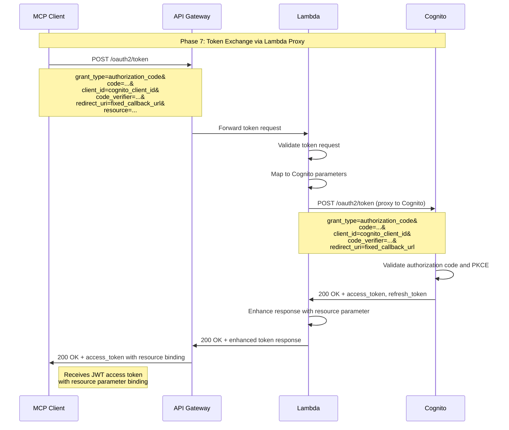
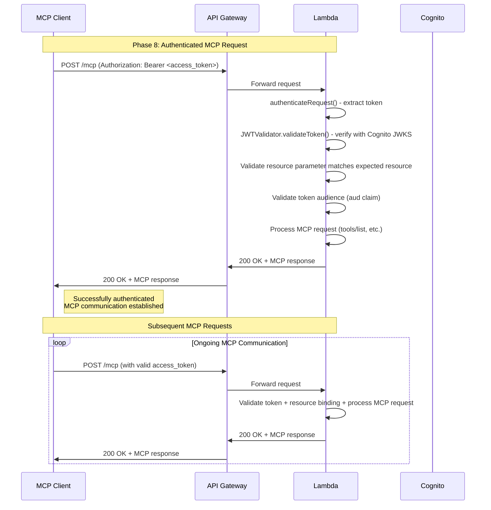

# OAuth Authorization MCP Server

AWS Lambda上で動作するOAuth認証機能付きMCP（Model Context Protocol）サーバーのサンプル実装です。

## 概要

このプロジェクトは、OAuth 2.1仕様に基づく認証機能を持つMCPサーバーの実装例を提供します。HonoフレームワークとMCP TypeScript SDKを使用し、セキュアなMCPサーバーをAWS Lambda上で構築する方法を示しています。

## 特徴

- **OAuth 2.1認証**: 標準的なOAuth認証フローを実装
- **AWS Lambda対応**: サーバーレス環境での動作に最適化
- **Honoフレームワーク**: 軽量で高速なWebフレームワークを使用
- **Streamable HTTP**: MCPのStreamable HTTP仕様をステートレスで実装
- **TypeScript**: 型安全性を確保した開発
- **認証ミドルウェア**: リクエストの認証処理を自動化
- **メタデータエンドポイント**: OAuth設定情報の提供
- **動的クライアント登録**: OAuth クライアントの動的登録をサポート

## 技術スタック

- **MCP TypeScript SDK**: Model Context Protocolの公式TypeScript実装
- **Hono**: Web Standards準拠の軽量Webフレームワーク
- **fetch-to-node**: MCPのTypeScript SDKとHonoの互換性のためのアダプター
- **AWS Lambda**: サーバーレス実行環境
- **AWS SAM**: サーバーレスアプリケーションの構築・デプロイツール
- **OAuth 2.1**: 認証・認可プロトコル

## プロジェクト構成

```
oauth-authorization/
├── hello-world/              # Lambda関数のTypeScriptコード
│   ├── app.ts               # メインアプリケーションファイル
│   ├── middleware/          # 認証ミドルウェア
│   │   └── auth.ts         # OAuth認証処理
│   ├── routes/             # ルートハンドラー
│   │   ├── metadata.ts     # OAuth メタデータエンドポイント
│   │   ├── oauth.ts        # OAuth認証エンドポイント
│   │   └── registration.ts # クライアント登録エンドポイント
│   ├── package.json        # 依存関係の定義
│   └── tests/              # ユニットテスト
├── events/                 # 関数呼び出し用のテストイベント
├── template.yaml           # AWSリソース定義（SAMテンプレート）
└── samconfig.toml          # SAM設定ファイル
```

## MCPツール

このサーバーは以下のツールを提供します：

### calculate-bmi
BMI（Body Mass Index）を計算するツールです。

**入力パラメータ:**
- `weightKg` (number): 体重（キログラム）
- `heightM` (number): 身長（メートル）

**出力:**
- 計算されたBMI値（数値）

**注意**: このツールにアクセスするには有効なOAuthアクセストークンが必要です。

## OAuth認証フロー

このサーバーは以下のOAuth 2.1エンドポイントを提供します：

### 1. メタデータエンドポイント (`/.well-known/oauth-authorization-server`)
OAuth認証サーバーの設定情報を提供します。

### 2. 保護されたリソースメタデータエンドポイント (`/.well-known/oauth-protected-resource`)
保護されたリソースの情報を提供します。

### 3. クライアント登録エンドポイント (`/register`)
OAuth クライアントの動的登録を行います。

### 4. 認証エンドポイント (`/oauth2/authorize`)
OAuth認証フローの開始点です。

### 5. コールバックエンドポイント (`/oauth2/callback`)
OAuth認証のコールバック処理を行います。

### 6. トークンエンドポイント (`/oauth2/token`)
アクセストークンの取得・更新を行います。

## OAuth 2.1 認証フローシーケンス図

以下は、MCP クライアントとサーバー間のOAuth 2.1認証フローの詳細なシーケンス図です：

### Phase 1: 初回MCPリクエスト（未認証）



### Phase 2: メタデータ発見



### Phase 3: 動的クライアント登録



### Phase 4: 認証フロー開始



### Phase 5: Cognito認証



### Phase 6: OAuthコールバック処理



### Phase 7: トークン交換（Lambdaプロキシ）



### Phase 8: 認証済みMCPリクエスト



## 前提条件

以下のツールがインストールされている必要があります：

- [SAM CLI](https://docs.aws.amazon.com/serverless-application-model/latest/developerguide/serverless-sam-cli-install.html) - AWS SAMアプリケーションの構築・デプロイ用
- [Node.js 22](https://nodejs.org/en/) - NPMパッケージマネージャーを含む
- [Docker](https://hub.docker.com/search/?type=edition&offering=community) - ローカル実行・テスト用

## 環境変数の設定

OAuth認証サーバーは、template.yamlで以下の環境変数が自動的に設定されます：

```yaml
Environment:
  Variables:
    COGNITO_USER_POOL_ID: !Ref CognitoUserPool
    COGNITO_USER_POOL_CLIENT_ID: !Ref CognitoUserPoolClient
    COGNITO_DOMAIN: !Sub https://${CognitoUserPoolDomain}.auth.${AWS::Region}.amazoncognito.com
    API_BASE_URL: !Sub https://${HttpApi}.execute-api.${AWS::Region}.amazonaws.com
```

これらの環境変数は、デプロイ時にAWS Cognitoリソースから自動的に取得されるため、手動設定は不要です。

## デプロイ手順

### 1. アプリケーションのビルドとデプロイ

```bash
sam build
sam deploy --guided
```

デプロイ時の設定項目：
- **Stack Name**: CloudFormationスタック名
- **AWS Region**: デプロイ先のAWSリージョン
- **Confirm changes before deploy**: デプロイ前の変更確認の有無
- **Allow SAM CLI IAM role creation**: IAMロール作成の許可

デプロイ完了後、以下のリソースが自動的に作成されます：
- AWS Cognito User Pool（認証用）
- AWS Cognito User Pool Client（OAuth クライアント）
- AWS Cognito User Pool Domain（認証ドメイン）
- API Gateway（HTTPエンドポイント）

## ローカル開発・テスト

### 環境変数の設定

ローカル開発時は、実際の環境変数名を使用します：

```bash
# .env ファイル
COGNITO_USER_POOL_ID=us-east-1_xxxxxxxxx
COGNITO_USER_POOL_CLIENT_ID=xxxxxxxxxxxxxxxxxxxxxxxxxx
COGNITO_DOMAIN=https://your-stack-oauth-domain-123456789012.auth.us-east-1.amazoncognito.com
API_BASE_URL=http://localhost:3000
```

### ローカルAPIの起動

```bash
sam local start-api --env-vars env.json
```

`env.json`ファイルの例：

```json
{
  "HelloWorldFunction": {
    "COGNITO_USER_POOL_ID": "us-east-1_xxxxxxxxx",
    "COGNITO_USER_POOL_CLIENT_ID": "xxxxxxxxxxxxxxxxxxxxxxxxxx",
    "COGNITO_DOMAIN": "https://your-stack-oauth-domain-123456789012.auth.us-east-1.amazoncognito.com",
    "API_BASE_URL": "http://localhost:3000"
  }
}
```

### OAuth認証のテスト

1. **メタデータの取得**:
   ```bash
   curl http://localhost:3000/.well-known/oauth-authorization-server
   ```

2. **保護されたリソースメタデータの取得**:
   ```bash
   curl http://localhost:3000/.well-known/oauth-protected-resource
   ```

3. **クライアント登録**:
   ```bash
   curl -X POST http://localhost:3000/register \
     -H "Content-Type: application/json" \
     -d '{"client_name": "Test Client", "redirect_uris": ["http://localhost:3000/oauth2/callback"]}'
   ```

4. **認証フローの開始**:
   ```bash
   curl "http://localhost:3000/oauth2/authorize?client_id=your-client-id&response_type=code&redirect_uri=http://localhost:3000/oauth2/callback"
   ```

## MCPクライアントでの使用

OAuth認証付きMCPサーバーをMCPクライアントで使用する場合の設定例：

### VS Code設定例

```json
{
  "servers": {
    "oauth-mcp": {
      "url": "https://your-api-gateway-url.execute-api.us-east-1.amazonaws.com/mcp"
    }
  }
}
```

**注意**: OAuth認証フローは、MCPクライアントがOAuth認証をサポートしている場合に自動的に処理されます。クライアントがOAuth認証をサポートしていない場合は、事前にアクセストークンを取得してヘッダーに設定する必要があります。

## 実装の詳細

### 認証ミドルウェア

```typescript
export const authenticateRequest = async (c: Context, next: Next) => {
  const authHeader = c.req.header('Authorization');
  
  if (!authHeader || !authHeader.startsWith('Bearer ')) {
    return c.json({ error: 'Unauthorized' }, 401);
  }
  
  const token = authHeader.substring(7);
  // トークンの検証ロジック
  
  await next();
};
```

### OAuth エンドポイントの実装

各OAuth エンドポイントは個別のルートファイルで実装されており、標準的なOAuth 2.1仕様に準拠しています。

## ユニットテスト

テストは`hello-world/tests`フォルダに定義されています。現在のテストコードはSAM初期化時のテンプレートのままのため、MCP機能とOAuth認証機能に対応したテストに更新が必要です：

```bash
cd hello-world
npm install
npm run test
```

## リソースの削除

作成したリソースを削除するには：

```bash
sam delete --stack-name oauth-authorization
```

## 参考資料

- [OAuth 2.1 仕様](https://datatracker.ietf.org/doc/html/draft-ietf-oauth-v2-1-12)
- [MCP Authorization 仕様](https://modelcontextprotocol.io/docs/concepts/authorization)
- [Model Context Protocol 公式ドキュメント](https://modelcontextprotocol.io/)
- [Hono 公式ドキュメント](https://hono.dev/)
- [AWS SAM 開発者ガイド](https://docs.aws.amazon.com/serverless-application-model/latest/developerguide/what-is-sam.html)
